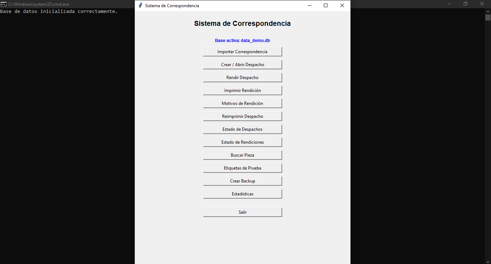
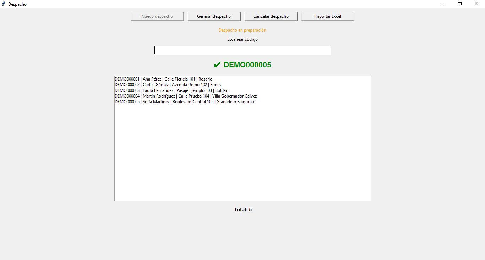
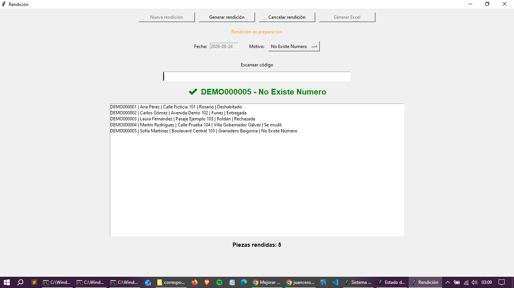
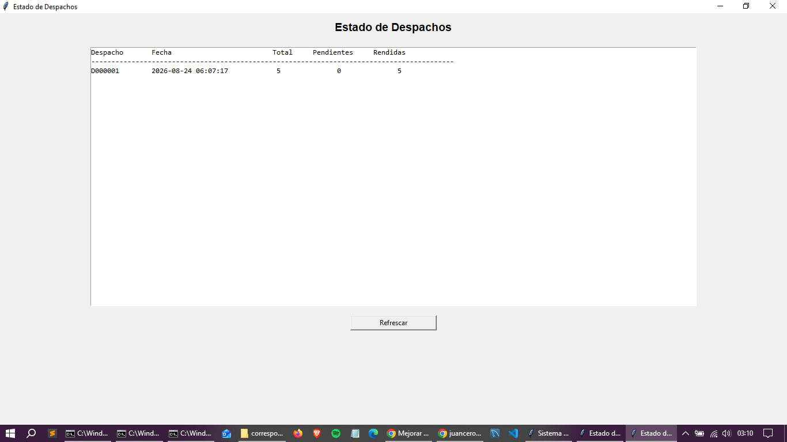
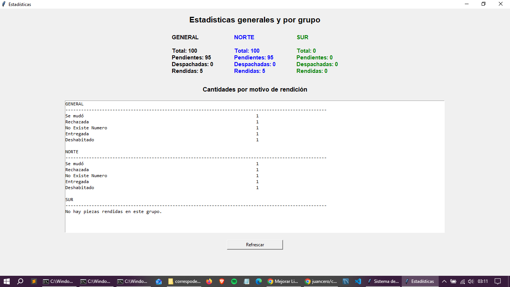
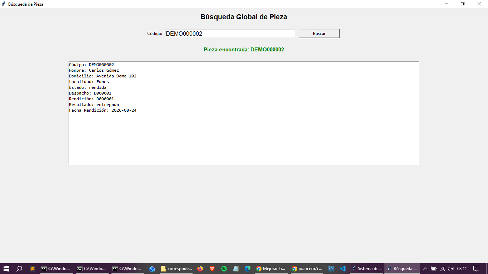

# Sistema de Gestión de Correspondencia y Logística

Aplicación de escritorio desarrollada para gestionar el circuito operativo de correspondencia y logística, permitiendo realizar el seguimiento individual de piezas desde su ingreso hasta su despacho y posterior rendición.

El sistema fue diseñado a partir de necesidades operativas reales, contemplando el manejo de grandes volúmenes de registros, lectura mediante códigos, control de estados, generación de documentación y aplicación de reglas de negocio para evitar inconsistencias.

> Este repositorio contiene una versión demostrativa del proyecto. No incluye bases de datos operativas, información personal ni datos reales.

## Funcionalidades principales

- Importación masiva de correspondencias desde archivos Excel.
- Identificación y búsqueda individual de piezas.
- Lectura de códigos mediante scanner.
- Creación y administración de despachos.
- Control de piezas duplicadas y validación de estados.
- Rendición de correspondencias.
- Administración de motivos de rendición.
- Seguimiento del estado de cada pieza.
- Consulta del detalle de despachos y rendiciones.
- Reimpresión de documentación.
- Generación de comprobantes en PDF.
- Exportación de información a Excel.
- Estadísticas operativas.
- Generación de backups de la base de datos.

## Flujo general

El sistema administra el ciclo de vida de cada correspondencia:

```text
Importación
    ↓
Pendiente
    ↓
Despacho
    ↓
Despachada
    ↓
Rendición
    ↓
Rendida
```

Las operaciones están sujetas a validaciones y reglas de negocio para preservar la consistencia de la información.

## Tecnologías utilizadas

- Python
- Tkinter
- SQLite
- ReportLab
- openpyxl
- Git

## Estructura del proyecto

```text
correspondence-management-system/
│
├── app.py
├── database.py
├── schema.sql
│
├── screens/
│   └── Interfaces de usuario
│
├── services/
│   └── Lógica de negocio y servicios
│
└── herramientas/
    ├── crear_base_demo.py
    └── cargar_datos_demo.py
```

La aplicación separa la interfaz gráfica de la lógica encargada de despachos, rendiciones, importaciones, exportaciones, generación de documentos y acceso a datos.

## Base de datos

El sistema utiliza SQLite como motor de persistencia.

Entre las principales entidades se encuentran:

- Correspondencias
- Despachos
- Detalle de despachos
- Rendiciones
- Detalle de rendiciones
- Motivos de rendición

Se utilizan claves foráneas, índices y reglas de integridad para mantener la consistencia entre las distintas operaciones.

## Versión demostrativa

Por razones de privacidad y confidencialidad, las bases de datos utilizadas en el entorno operativo no forman parte de este repositorio.

El proyecto incluye herramientas para generar una base independiente destinada exclusivamente a demostración.

Para crearla:

```bash
cd herramientas
python crear_base_demo.py
```

Esto genera la estructura necesaria y carga los motivos de rendición utilizados por la aplicación.

Luego pueden generarse correspondencias ficticias ejecutando:

```bash
python cargar_datos_demo.py
```

El script genera 100 registros ficticios para permitir probar el funcionamiento del sistema sin utilizar información real.

## Ejecución

Una vez creada la base demostrativa, desde el directorio principal:

```bash
python app.py
```

La aplicación detectará la base configurada para el entorno demo y permitirá utilizar las principales funcionalidades del sistema.

## Privacidad de los datos

Este repositorio no contiene:

- Información personal real.
- Bases de datos operativas.
- Backups de producción.
- Documentación generada a partir de operaciones reales.

Los archivos de base de datos y otros archivos generados por la aplicación están excluidos mediante `.gitignore`.

Los datos utilizados para la demostración son ficticios y fueron creados exclusivamente para esta versión pública.

## Capturas de la aplicación

Las siguientes capturas corresponden a la versión demostrativa del sistema y utilizan exclusivamente datos ficticios.

### Pantalla principal



### Preparación de despacho

Carga de piezas y preparación de un despacho antes de su generación.



### Procesamiento de rendición

Registro de resultados de entrega y motivos de rendición para las piezas procesadas.



### Estado del despacho

Seguimiento de piezas pendientes y rendidas dentro de cada despacho.



### Estadísticas operativas

Resumen del estado general de las correspondencias y distribución de rendiciones por resultado.



### Trazabilidad de una pieza

Consulta individual de una correspondencia con información de despacho, rendición, resultado y estado actual.



## Estado del proyecto

Proyecto funcional en evolución.

El sistema contempla actualmente gestión de correspondencias, despachos, rendiciones, generación de documentación, exportaciones, búsquedas y estadísticas operativas.

La versión publicada está preparada como entorno demostrativo independiente del entorno operativo.